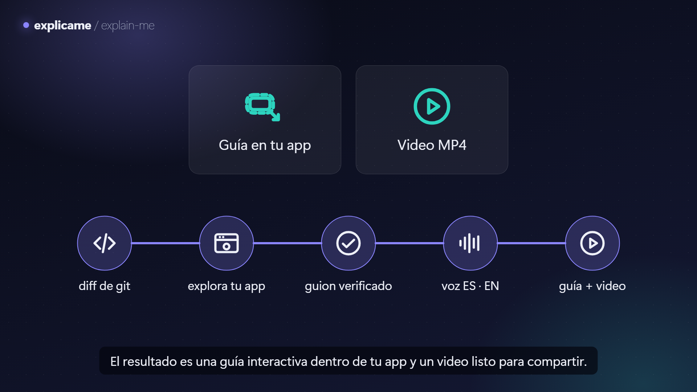
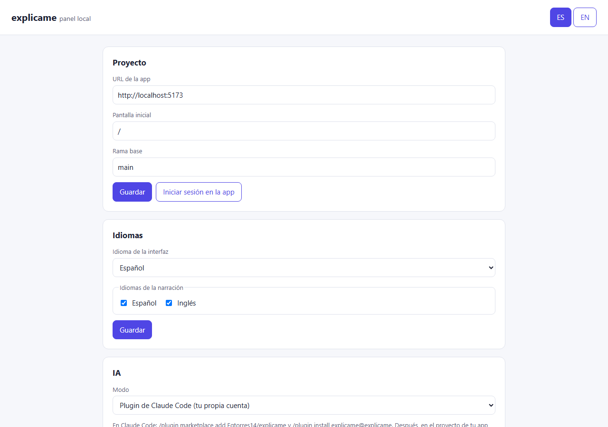
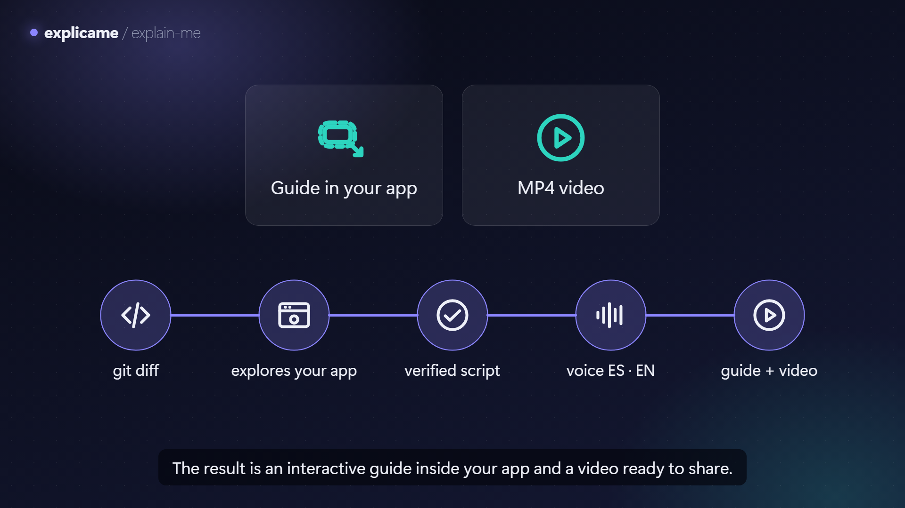

# explicame / explain-me

[](https://github.com/Egtorres14/explicame/actions/workflows/ci.yml)
[](LICENSE)

**[Español](#español) · [English](#english)**

---

## Español

**explicame genera la guía narrada de cada funcionalidad nueva a partir del cambio en tu código.** La IA lee
el diff, recorre tu app real en un navegador, escribe el guion en español y en inglés, lo verifica paso a paso
en la pantalla real y le pone voz. El resultado es una guía interactiva dentro de tu app («¿Cómo funciona?») y
un video MP4 con subtítulos.

[](https://github.com/Egtorres14/explicame/releases/download/v0.1.0/explicame.es.mp4)

▶ [Ver el video en español (MP4)](https://github.com/Egtorres14/explicame/releases/download/v0.1.0/explicame.es.mp4) · [English version](https://github.com/Egtorres14/explicame/releases/download/v0.1.0/explicame.en.mp4)

```
diff de git → la IA explora la app real → guion bilingüe verificado → voz → guía en la app + video MP4
```

### Qué hace

- **La IA no adivina a qué apuntar.** Explora la app en un navegador real y cada paso queda verificado
  contra la pantalla real; si un paso falla, tiene un intento para repararlo.
- **Nada se guarda en tu app.** Mientras genera, verifica, graba o reproduce, se bloquea toda petición que
  escriba datos, y los botones de guardar, enviar o borrar solo se señalan.
- **Dos modos de IA:** con tu propia cuenta, como plugin de Claude Code, o con una API key de Claude.
- **Voces a elegir:** ElevenLabs, Deepgram, OpenAI, o gratis con Piper, tu propio comando o la voz del navegador.
- **Bilingüe de punta a punta:** CLI, panel, reproductor y narración en español e inglés.

### Inicio rápido (3 comandos)

```bash
git clone https://github.com/Egtorres14/explicame && cd explicame
npm install && npx playwright install chromium && npm run build && npm link -w explicame
cd /ruta/a/tu-app && explicame panel
```

`npm link` deja los comandos `explicame` y `explain-me` en tu terminal. El panel se abre en el navegador:
ahí eliges la URL de tu app, los idiomas, el modo de IA y la voz, y generas la guía.

¿Quieres verla funcionando antes? En el repo, `npm run dev -w demo-app`, abre http://localhost:5173 y pulsa
«¿Cómo funciona?»: esa guía la escribió Claude Code con el plugin de explicame.

### Los dos modos

| Modo | Cómo | Qué necesitas |
|---|---|---|
| **Plugin de Claude Code** (tu cuenta) | En Claude Code: `/plugin marketplace add Egtorres14/explicame`, `/plugin install explicame@explicame` y luego `/explicame:explicame Agrega un filtro por fecha`. Claude Code explora la app con las herramientas de explicame y guarda la guía verificada; después `explicame build --from-guide <ruta> --video` le pone voz y la graba. | Claude Code y la CLI enlazada. Detalles en [`plugin/README.md`](plugin/README.md). |
| **API key de Claude** | `explicame build` (o el botón «Generar guía» del panel). Antes de empezar muestra un estimado del costo. | `ANTHROPIC_API_KEY` o la clave guardada desde el panel. Modelo por defecto `claude-opus-5-5`; `claude-sonnet-5-5` es más económico. |

### El panel

`explicame panel` abre un panel local en http://127.0.0.1:4747 con secciones Proyecto, Idiomas, IA, Voz,
Generar y Guías: iniciar sesión en tu app, guardar claves (solo se muestran sus últimos 4 caracteres), probar
voces, clonar tu voz en ElevenLabs con consentimiento explícito, generar con avance en vivo y capturas, parar,
y ver o descargar la guía y los videos.



### Voces

| Proveedor | Costo | Clave | Notas |
|---|---|---|---|
| ElevenLabs | De pago (tiene nivel gratis) | `ELEVENLABS_API_KEY` | Modelo `eleven_v4` por defecto. Necesita ids de voz en `voice.voices.es/en`. Desde el panel puedes clonar tu voz, solo con la casilla de consentimiento. |
| Deepgram | De pago (créditos iniciales) | `DEEPGRAM_API_KEY` | Aura-2; por defecto `aura-2-celeste-es` y `aura-2-thalia-en`. |
| OpenAI | De pago | `OPENAI_API_KEY` | `gpt-4o-mini-tts`, voz `coral` por defecto. |
| Piper | Gratis, local | — | La primera vez descarga el motor (~25 MB, verificado por SHA-256) y las voces en `~/.explicame/piper`. Voces por defecto de licencia limpia: `es_ES-carlfm-x_low` y `en_US-ljspeech-medium`. `es_MX-ald-medium` suena mejor, pero deriva de una voz con licencia solo para investigación. Windows x64 (necesita el runtime de Visual C++) y Linux; en macOS usa el comando propio. |
| Comando propio | Gratis | — | `voice.command`, p. ej. `"kokoro {textFile} {out} --voice {voice}"`. Marcadores: `{text}`, `{textFile}`, `{lang}`, `{voice}`, `{speed}`, `{out}` (WAV) o `{outMp3}`. Se ejecuta sin shell. |
| Navegador | Gratis | — | No genera archivos: la guía usa la voz del sistema de quien la ve. No sirve para el MP4. |

`voice.fallback` define respaldos si el principal falla; las voces configuradas son del proveedor principal y
cada respaldo usa las suyas. El audio se guarda en caché por proveedor, voz, idioma, velocidad y texto.

### Integrar el reproductor en tu app

`explicame build` deja el reproductor junto a las guías (`public/explicame/` por defecto). Una línea:

```html
<script src="/explicame/explicame-player.js"></script>
<script>Explicame.mount()</script>
```

O con módulos: `import { mount } from "@explicame/player"`. Opciones de `mount`: `base` (`/explicame`), `lang`,
`button` (botón flotante, `true`), `navigate` (la función de tu router: **úsala en apps de una sola página con
pasos `navigate`**), `allowRequests`, `onBlockedRequest`, `zIndex`. API: `Explicame.play(id)`,
`Explicame.stop()`, `Explicame.on("step" | "end" | "blocked" | "missing", fn)`.

### Comandos

| Comando | Qué hace |
|---|---|
| `explicame build` | diff → exploración → guion verificado → voz. Opciones: `--base`, `--head`, `--diff-file`, `--files`, `--describe`, `--id`, `--no-voice`, `--video`, `--from-guide <ruta>` (solo voz y publicación, sin IA). |
| `explicame verify <guide.json>` | Reproduce la guía en un navegador limpio y comprueba cada paso. |
| `explicame voice <guide.json>` | Genera o regenera el audio. |
| `explicame record <guide.json> [--lang es,en]` | Graba el MP4 (H.264 + AAC, 1920×1080) y el `.srt` de cada idioma. |
| `explicame login` | Abre tu app para que inicies sesión una vez; la sesión se guarda fuera del proyecto. |
| `explicame panel [--port 4747] [--no-open]` | El panel local. |
| `explicame mcp` | El servidor MCP que usa el plugin de Claude Code (stdio). |

Códigos de salida: 0 éxito, 1 verificación fallida, 2 configuración o credenciales, 3 app no accesible,
4 proveedor externo caído.

### Configuración

`explicame.config.json` en la raíz de tu proyecto (sin secretos: la CLI rechaza claves aquí):

```json
{
  "appUrl": "http://localhost:5173",
  "startUrl": "/",
  "base": "main",
  "languages": ["es", "en"],
  "uiLanguage": "es",
  "mode": "api",
  "model": "claude-opus-5-5",
  "maxSteps": 15,
  "voice": { "provider": "piper", "voices": {}, "speed": 1, "fallback": [] },
  "outputDir": "public/explicame",
  "videoDir": ".explicame/videos",
  "safety": { "allowRequests": [{ "method": "POST", "url": "/graphql*" }] }
}
```

Las claves van en variables de entorno (`ANTHROPIC_API_KEY`, `ELEVENLABS_API_KEY`, `DEEPGRAM_API_KEY`,
`OPENAI_API_KEY`) o en `~/.explicame/credentials.json`, que el panel escribe con permisos solo para ti.

### Seguridad

- **Qué se bloquea:** en la generación, la verificación y la grabación, el navegador aborta toda petición que no
  sea GET, HEAD u OPTIONS (salvo las de `safety.allowRequests`). En el reproductor, mientras suena una guía, se
  envuelven `fetch` y `XMLHttpRequest` con la misma regla y un velo impide tocar la app.
- **Qué no se intercepta en el reproductor:** WebSocket, `navigator.sendBeacon`, el envío nativo de un
  `<form>` (los botones de envío nunca se pulsan) y referencias a `fetch` guardadas antes de `mount()`.
- **La IA no pulsa** botones de envío ni los que digan guardar, enviar, eliminar, borrar, pagar, confirmar,
  publicar (o sus equivalentes en inglés): solo los señala y los explica.
- **El panel** solo escucha en 127.0.0.1, exige un token aleatorio por sesión en la URL y en cada petición,
  rechaza otros nombres de host y nunca devuelve una clave completa.
- **Piper** se descarga de su fuente oficial y se verifica por SHA-256; su espeak-ng (GPL-3.0) se ejecuta como
  un programa aparte.

### Requisitos

- Node.js 20 o superior y Git.
- Chromium de Playwright: `npx playwright install chromium`.
- ffmpeg para el MP4, Piper y el comando propio: Windows `winget install Gyan.FFmpeg`, macOS
  `brew install ffmpeg`, Linux `sudo apt install ffmpeg`.
- Piper: Windows x64 con el runtime de Visual C++ 2015–2022, o Linux x86_64/arm64 con glibc 2.29 o superior.

### Preguntas frecuentes

- **¿Necesito una API key?** No: con el plugin de Claude Code usas tu propia cuenta.
- **¿Mi app necesita login?** Ejecuta `explicame login` una vez (o el botón del panel).
- **¿Qué pasa si un paso no se puede verificar?** La IA tiene un intento de repararlo; si vuelve a fallar, el
  build termina con código 1 y deja un reporte con la captura en `.explicame/reports/`.
- **¿Puedo editar la guía a mano?** Sí: `guide.json` es JSON validado. `explicame verify` la comprueba y
  `explicame voice` regenera el audio.
- **¿Cuánto cuesta en modo API?** Antes de empezar se muestra un estimado según el modelo y los pasos máximos.
- **¿Está en npm?** Todavía no: se usa clonando el repo y con `npm link`.

### Origen y licencia

La idea nació en la función «¿Cómo funciona?» que el autor construyó para una plataforma de operaciones en
producción: guiones escritos a mano que recorren la pantalla real con voz. explicame hace que la IA escriba esos
guiones sola, para cualquier app web. Contribuciones bienvenidas: [`CONTRIBUTING.md`](CONTRIBUTING.md).

MIT © 2026 Gabriel Torres Mendivil

---

## English

**explicame turns the change in your code into a narrated guide for every new feature.** The AI reads the
diff, walks through your running app in a real browser, writes the script in Spanish and English, verifies every
step on the real screen and gives it a voice. You get an interactive guide inside your app ("How does it
work?") and an MP4 video with subtitles.

[](https://github.com/Egtorres14/explicame/releases/download/v0.1.0/explicame.en.mp4)

▶ [Watch the video in English (MP4)](https://github.com/Egtorres14/explicame/releases/download/v0.1.0/explicame.en.mp4) · [Versión en español](https://github.com/Egtorres14/explicame/releases/download/v0.1.0/explicame.es.mp4)

```
git diff → the AI explores the running app → verified bilingual script → voice → in-app guide + MP4 video
```

### What it does

- **Grounded, not guessed.** The AI explores the app in a real browser and every step is verified against the
  real screen; a failing step gets one repair attempt.
- **Nothing is saved to your app.** While generating, verifying, recording or playing, every request that
  writes data is blocked, and save, send or delete buttons are only pointed at.
- **Two AI modes:** your own account as a Claude Code plugin, or a Claude API key.
- **Pick your voice:** ElevenLabs, Deepgram, OpenAI, or free with Piper, your own command or the browser voice.
- **Bilingual end to end:** CLI, panel, player and narration in Spanish and English.

### Quick start (3 commands)

```bash
git clone https://github.com/Egtorres14/explicame && cd explicame
npm install && npx playwright install chromium && npm run build && npm link -w explicame
cd /path/to/your-app && explicame panel
```

`npm link` puts the `explicame` and `explain-me` commands in your terminal. The panel opens in your browser:
set your app's URL, the languages, the AI mode and the voice, and generate the guide.

Want to see it first? In the repo, run `npm run dev -w demo-app`, open http://localhost:5173 and press "How
does it work?": Claude Code wrote that guide with the explicame plugin.

### The two modes

| Mode | How | What you need |
|---|---|---|
| **Claude Code plugin** (your account) | In Claude Code: `/plugin marketplace add Egtorres14/explicame`, `/plugin install explicame@explicame`, then `/explicame:explicame Add a date filter`. Claude Code explores the app with explicame's tools and saves the verified guide; then `explicame build --from-guide <path> --video` voices and records it. | Claude Code and the linked CLI. Details in [`plugin/README.md`](plugin/README.md). |
| **Claude API key** | `explicame build` (or the panel's "Generate guide" button). It shows a cost estimate before starting. | `ANTHROPIC_API_KEY` or the key saved from the panel. Default model `claude-opus-5-5`; `claude-sonnet-5-5` is cheaper. |

### The panel

`explicame panel` opens a local panel at http://127.0.0.1:4747 with Project, Languages, AI, Voice, Generate and
Guides sections: log in to your app, store keys (only their last 4 characters are ever shown), try voices, clone
your voice on ElevenLabs with explicit consent, generate with live progress and screenshots, stop, and watch or
download the guide and the videos.

### Voices

| Provider | Cost | Key | Notes |
|---|---|---|---|
| ElevenLabs | Paid (free tier) | `ELEVENLABS_API_KEY` | `eleven_v4` by default. Needs voice ids in `voice.voices.es/en`. The panel can clone your voice, only with the consent box ticked. |
| Deepgram | Paid (starter credits) | `DEEPGRAM_API_KEY` | Aura-2; `aura-2-celeste-es` and `aura-2-thalia-en` by default. |
| OpenAI | Paid | `OPENAI_API_KEY` | `gpt-4o-mini-tts`, voice `coral` by default. |
| Piper | Free, local | — | Downloads the engine (~25 MB, SHA-256 checked) and the voices into `~/.explicame/piper` the first time. Default voices with a clean license: `es_ES-carlfm-x_low` and `en_US-ljspeech-medium`. `es_MX-ald-medium` sounds better but derives from a research-only voice. Windows x64 (needs the Visual C++ runtime) and Linux; on macOS use your own command. |
| Your own command | Free | — | `voice.command`, e.g. `"kokoro {textFile} {out} --voice {voice}"`. Placeholders: `{text}`, `{textFile}`, `{lang}`, `{voice}`, `{speed}`, `{out}` (WAV) or `{outMp3}`. Runs without a shell. |
| Browser | Free | — | No audio files: the guide uses the viewer's system voice. Not usable for the MP4. |

`voice.fallback` lists providers to try if the main one fails; configured voices belong to the main provider and
each fallback uses its own. Audio is cached per provider, voice, language, speed and text.

### Embed the player in your app

`explicame build` puts the player next to the guides (`public/explicame/` by default). One line:

```html
<script src="/explicame/explicame-player.js"></script>
<script>Explicame.mount()</script>
```

Or as a module: `import { mount } from "@explicame/player"`. `mount` options: `base` (`/explicame`), `lang`,
`button` (floating button, `true`), `navigate` (your router's function: **use it in single-page apps with
`navigate` steps**), `allowRequests`, `onBlockedRequest`, `zIndex`. API: `Explicame.play(id)`,
`Explicame.stop()`, `Explicame.on("step" | "end" | "blocked" | "missing", fn)`.

### Commands

| Command | What it does |
|---|---|
| `explicame build` | diff → exploration → verified script → voice. Options: `--base`, `--head`, `--diff-file`, `--files`, `--describe`, `--id`, `--no-voice`, `--video`, `--from-guide <path>` (voice and publishing only, no AI). |
| `explicame verify <guide.json>` | Replays the guide in a fresh browser and checks every step. |
| `explicame voice <guide.json>` | (Re)generates the audio. |
| `explicame record <guide.json> [--lang es,en]` | Records the MP4 (H.264 + AAC, 1920×1080) and the `.srt` for each language. |
| `explicame login` | Opens your app so you log in once; the session is kept outside the project. |
| `explicame panel [--port 4747] [--no-open]` | The local panel. |
| `explicame mcp` | The MCP server used by the Claude Code plugin (stdio). |

Exit codes: 0 success, 1 verification failed, 2 configuration or credentials, 3 app unreachable, 4 external
provider down.

### Configuration

`explicame.config.json` at your project's root (no secrets: the CLI refuses keys there). See the Spanish section
for a full example; every field has a default. Keys go in environment variables (`ANTHROPIC_API_KEY`,
`ELEVENLABS_API_KEY`, `DEEPGRAM_API_KEY`, `OPENAI_API_KEY`) or in `~/.explicame/credentials.json`, which the
panel writes readable by you only.

### Security

- **What is blocked:** while generating, verifying and recording, the browser aborts every request other than
  GET, HEAD or OPTIONS (except `safety.allowRequests`). In the player, while a guide plays, `fetch` and
  `XMLHttpRequest` follow the same rule and a veil keeps the app from being touched.
- **What the player does not intercept:** WebSocket, `navigator.sendBeacon`, native `<form>` submission (submit
  buttons are never clicked) and `fetch` references taken before `mount()`.
- **The AI never clicks** submit buttons or buttons that say save, send, delete, remove, pay, confirm, publish
  (or their Spanish equivalents): it points at them and explains them.
- **The panel** listens on 127.0.0.1 only, requires a random per-session token in the URL and in every
  request, rejects other host names and never returns a whole key.
- **Piper** is downloaded from its official source and checked by SHA-256; its espeak-ng (GPL-3.0) runs as a
  separate program.

### Requirements

- Node.js 20 or newer, and Git.
- Playwright's Chromium: `npx playwright install chromium`.
- ffmpeg for the MP4, Piper and your own command: Windows `winget install Gyan.FFmpeg`, macOS
  `brew install ffmpeg`, Linux `sudo apt install ffmpeg`.
- Piper: Windows x64 with the Visual C++ 2015–2022 runtime, or Linux x86_64/arm64 with glibc 2.29 or newer.

### FAQ

- **Do I need an API key?** No: with the Claude Code plugin you use your own account.
- **My app needs a login?** Run `explicame login` once (or use the panel's button).
- **What if a step cannot be verified?** The AI gets one attempt to repair it; if it fails again, the build ends
  with code 1 and a report with the screenshot in `.explicame/reports/`.
- **Can I edit the guide by hand?** Yes: `guide.json` is validated JSON. `explicame verify` checks it and
  `explicame voice` regenerates the audio.
- **How much does API mode cost?** An estimate based on the model and the maximum steps is shown before starting.
- **Is it on npm?** Not yet: clone the repo and use `npm link`.

### Origin and license

The idea comes from the "How does it work?" feature the author built for a production operations platform:
hand-written scripts that walk the real screen with a voice. explicame lets the AI write those scripts on its
own, for any web app. Contributions welcome: [`CONTRIBUTING.md`](CONTRIBUTING.md).

MIT © 2026 Gabriel Torres Mendivil
